# U.S. Executions Interactive with D3

## Overview

In this tutorial, we'll cover some basic skills for building
a D3 interactive visualization using data on [U.S. death penalty executions][]. The end goal is an interactive column chart of executions broken down by year.

[U.S. death penalty executions]: https://deathpenaltyinfo.org/

On a technical level, we'll cover the following:

* Setting up an application structure with external JS and CSS files
* Using a local test server to read "remote" data
* Reading data from an external CSV file
* Preparing data in D3 for visualization
* Creating a column chart
* Adding a tooltip to display the number of executions for each year

## Set up the application

Let's create a new directory for our D3 project. On a command-line shell, execute the following:

```bash
mkdir executions-viz
cd executions-viz
```

Now create a basic HTML template called `index.html` containing the below source code:

```html
<!DOCTYPE html>
<html>
  <head>
      <meta charset="utf-8">
      <title>U.S. Executions</title>
      <link rel="stylesheet" type="text/css" href="app.css"/>
  </head>
  <body>
  	 <h1>U.S. Executions</h1>
    <svg></svg>
    <script src="https://d3js.org/d3.v5.min.js"></script>
    <script src="app.js" charset="utf-8"></script>
  </body>
</html>
```

Next, create external files for javascript and css (note these are referenced in the `index.html` file).

```
touch app.css app.js
```

Add the following to `app.css`:

```css
h1 {
  margin-left: 15px;
}
svg {
  margin-top: 40px;
  margin-left: 30px;
  overflow: visible;
}
rect {
  stroke:white;
  stroke-width:2px;
}
```

Finally, download the [execution_database.csv][] and drop it into `executions-viz` alongside the other files:

```bash
wget https://raw.githubusercontent.com/zstumgoren/executions-exercise/master/data/execution_database.csv
```

[execution_database.csv]: https://raw.githubusercontent.com/zstumgoren/executions-exercise/master/data/execution_database.csv

## Fire up a test server

Javascript has a built-in security feature called the [same-origin policy][] that requires "remote" data to be fetched from the same origin, or domain, as the source code itself. There are exceptions to this rule and various work-arounds, but browsers often enforce it even when you're working locally on your own machine.

[same-origin policy]: https://developer.mozilla.org/en-US/docs/Web/Security/Same-origin_policy

For example, in Chrome, you would get an error such as below when trying to access the `execution_database.csv` via Javascript using the [file scheme][]:

[file scheme]: https://en.wikipedia.org/wiki/File_URI_scheme

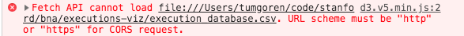

To work around this issue, we can set up a local development server
using Python to mimic a real-world server.

Open a new command-line shell, navigate to the project directory, and fire up the server: 

```
cd /path/to/executions-viz
# Below is Python 3.x syntax
python -m http.server
```

You can now access the files in this directory using the standard [localhost] domain and default port of 8000. For example:

[localhost]: https://en.wikipedia.org/wiki/Localhost

```
http://localhost:8000/index.html
http://localhost:8000/execution_database.csv
```

## Reading data

D3 offers a number of convenience methods to read data from different file formats. For this exercise, we'll learn to read CSV data using [d3.csv][], but it's worth noting that D3 also supports JSON, XML and other formats.

> Here's a [beginner-friendly intro][] to reading data with D3.

[d3.csv]: https://github.com/d3/d3-request/blob/master/README.md#csv
[beginner-friendly intro]: http://learnjsdata.com/read_data.html

### Read a CSV

The `execution_database.csv` contains roughly 1400 records of executions from 1977 to 2018. The data contains the following columns:

```
Date,Name,Age,Sex,Race,Number / Race / Sex of Victims,State,Region,Method,Juvenile,Federal,Volunteer,Foreign National,County
01/10/1986,James Roach,25,m,White,1 White Male(s)1 White Female(s),SC,S,Electrocution,Yes,No,No,No,Richland
01/11/1985,Joseph Shaw,29,m,White,1 White Male(s)1 White Female(s),SC,S,Electrocution,No,No,No,No,Richland
```

Let's read this data using [d3.csv][]. Add the following to `app.js` and then reload `http://localhost:8000/index.html` in your browser. **Make sure to open the developer toolbar**.

```js
//app.js
d3.csv("execution_database.csv")
  .then(function (data) {
    console.log(data);
  });
```

Above, the `d3.csv("executions_database.csv)` is followed by a `then` call, which in turn is passed a "callback" function. This syntax is known as a [Promise][]. It's Javascript's way of ensuring the data has loaded before we try to do work with data.

Notice the `data` argument is passed to this callback function. This lets us work with the data inside of `then`.

[Promise]: https://developer.mozilla.org/en-US/docs/Web/JavaScript/Guide/Using_promises

Open the Chrome Developer Toolbar and go to the Console tab. You should see the data logged (below we've expanded the data for a better view of the generated object):

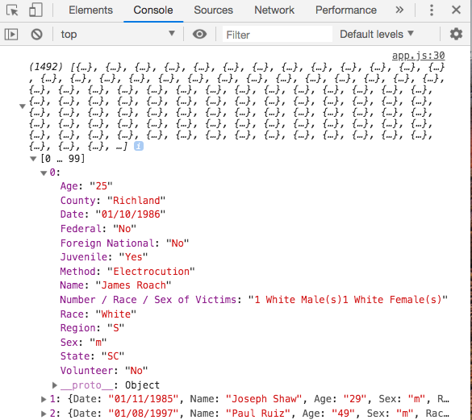

### Refine the read

For this visualization, we'll focus on a subset of records and columns. Let's start by selecting the below columns and preparing the data for use in our visualization:

* Date
* State
* Race
* Age
* Sex
* Method (of execution)

Update `app.js` so it looks like below:

```js
function row(d) {
  // Slice the year from the Date field
  let year = +d.Date.split('/').slice(-1).pop();
  // Only include executions from 2000 onward
  if (year >= 2000) {
    return {
      year: year,
      state: d.State,
      age: +d.Age,
      sex: d.Sex,
      race: d.Race,
      method: d.Method
    };
  };
}

d3.csv("execution_database.csv", row)
  .then(function (data) {
    console.log(data);
  });

```

A few notes on the above:

* The `row` function is an optional argument to [d3.csv][] that processes each incoming row of data in the CSV.
* The `+` sign convert strings to integers.
* We only return data from 2000 on.
* We created a new `year` field based on the original Date. This will help us group and sort by year.

If you view the data in the Chrome Developer console, you should notice we now have fewer than 1000 records and a smaller subset of fields:

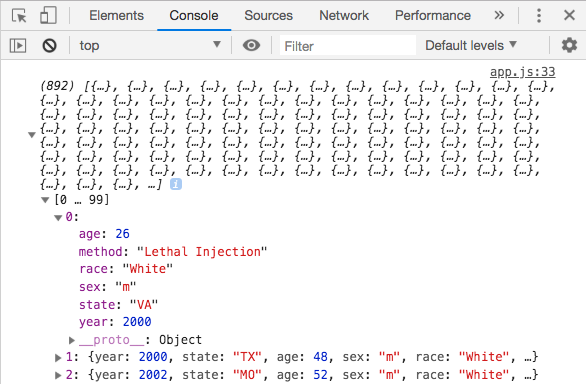

## Summarize the data

D3 offers powerful ways to [group][] and [summarize][] data for visualization. This type of work can also be performed ahead of time using a scripting language such as Python, but it's useful to be aware of these techniques in D3 as well.

[summarize]: http://learnjsdata.com/summarize_data.html
[group]: http://learnjsdata.com/summarize_data.html

Let's start by using [d3.nest][] to group our data by year. 

> The `nest` functionality is similar in concept to a SQL [GROUP BY][], although D3 supports multiple levels of nesting.

Update `app.js` as below:

[d3.nest]: https://github.com/d3/d3-collection#nests
[GROUP BY]: https://www.w3schools.com/sql/sql_groupby.asp

```js
d3.csv("execution_database.csv", row)
  .then(function (data) {

    // Group Executions by year
    var executionsByYear = d3.nest()
      .key(function(d) { return d.year }).sortKeys(d3.ascending)
      .entries(data);
    console.log(executionsByYear);
	});
```

Some notes on the above:

* `nest` returns an array of nested objects. Each object has a `key` and array of `values`. The latter is an array containing all the data items belonging to the given key.
* The [key][] function groups each data object by the `year` attribute.
* [sortKeys][] orders the keys by year, from lowest to highest
* We use the [entries][] function to pass in the data.

[key]: https://github.com/d3/d3-collection#nest_key
[sortKeys]: https://github.com/d3/d3-collection#nest_sortKeys
[entries]: https://github.com/d3/d3-collection#nest_entries

If you reload `index.html` and go to the Chrome Dev Tools console, you should see the below:

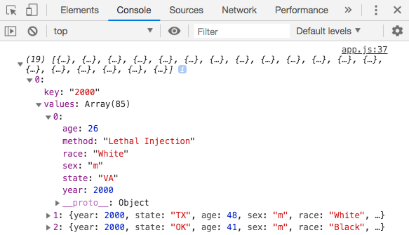

So we've grouped and sorted our data by year. Next, we need to count the number of executions by year. The yearly count will allow us to appropriately size the columns in the chart.

To get a count of executions for each year, update the code to include a call to [d3.rollup][]:

[d3.rollup]: https://github.com/d3/d3-collection#nest_rollup

```js
d3.csv("execution_database.csv", row)
  .then(function (data) {
    // Group Executions by year
    var executionsByYear = d3.nest()
      .key(function(d) { return d.year }).sortKeys(d3.ascending)
      .rollup(function(d) { return d.length })
      .entries(data);
    console.log(executionsByYear);
  });
```

The new data should look like this:

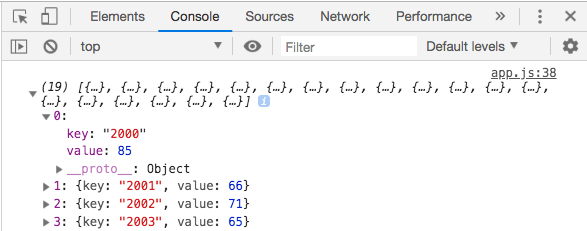

Note that the rollup function replaces the array of objects in `values` with a `value` key containing the count.

Our data is now in decent enough shape to begin creating the chart. As we add interactive elements, we can circle back to the data preparation code to update it as needed.

> Before moving on, don't forget to delete the `console.log` statement in the code!

## Chart the data

Let's start by setting a fixed height and width for the svg element. Add the following to the top of `app.js` (before the code that reads the data). 

> This section is modeled on the [Chapter 5 example code][] from the [D3.js Quick Start Guide][]. The example code includes lots of helpful annotations and some techniques omitted here, such as applying a color scale to the rectangles in the chart.

[Chapter 5 example code]: https://github.com/PacktPublishing/D3.js-Quick-Start-Guide/blob/master/Chapter05/app.js
[D3.js Quick Start Guide]: https://learning.oreilly.com/library/view/d3js-quick-start/9781789342383/?ar=

```js
var WIDTH = 600;
var HEIGHT = 400;
d3.select('svg')
    .style('width', WIDTH)
    .style('height', HEIGHT);
```

### Perform the data join

Next, let's map our data to `rect` HTML elements that will become the columns in the chart. You'll likely notice that the HTML doesn't contain any `rect` elements at the moment. 

D3 has the ability to dynamically generate HTML when you declare a mapping between data and page elements. This is a core feature of D3 that is critical to grasp. 

> Check out [Thinking With Joins][] and [Enter, Update, Exit][] for more background.

[Thinking With Joins]: https://bost.ocks.org/mike/join/
[Enter, Update, Exit]: https://medium.com/@c_behrens/enter-update-exit-6cafc6014c36

To perform the data join, update `app.js` to include the code below `// PERFORM A DATA JOIN`:

```js
d3.csv("execution_database.csv", row)
    .then(function (data) {
    
      var executionsByYear = d3.nest()
        .key(function(d) { return d.year }).sortKeys(d3.ascending)
        .rollup(function(d) { return d.length })
        .entries(data);

      // PERFORM DATA JOIN
      // Select the SVG and (yet-to-exist) rect
      // elements and perform a data join.
      d3.select('svg').selectAll('rect')
          .data(executionsByYear)
          .enter()
          .append('rect');
```

The above code creates a series of empty `rect` attributes in the HTML.

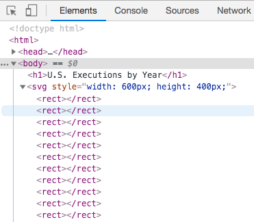

### Create scales

Next, we'll set up scales for our X and Y axes. Scales are another critical concept in D3. Here's an explanation from the official docs for [D3 scale][].

[D3 scale]: https://github.com/d3/d3-scale#d3-scale

> *Scales are a convenient abstraction for a fundamental task in visualization: mapping a dimension of abstract data to a visual representation. Although most often used for position-encoding quantitative data, such as mapping a measurement in meters to a position in pixels for dots in a scatterplot, scales can represent virtually any visual encoding, such as diverging colors, stroke widths, or symbol size.*

For our use case, we'll use a [linear scale][]. This scale has two critical components:

[linear scale]: https://github.com/d3/d3-scale#linear-scales

* [range][] - the min/max of the visual coordinates
* [domain][] - the min/max of values in our data

[range]: https://github.com/d3/d3-scale#continuous_range
[domain]: https://github.com/d3/d3-scale#continuous_domain

Configuring the range and domain for our scale will allow us to map data values to visual coordinates.

All of this is admittedly abstract. Let's add the below code and then spend some time tinkering in the Chrome Developer Toolbar to get a handle on these concepts.

```js
// Add this AFTER the data join code

// CREATE SCALES
// Create a y scale
var yScale = d3.scaleLinear();
yScale.range([HEIGHT, 0]);
var yMax = d3.max(executionsByYear, function(datum, index){ return datum.value; });
yScale.domain([0, yMax]);

// Create the x scale
var xScale = d3.scaleLinear();
xScale.range([0, WIDTH]);
xScale.domain([0, executionsByYear.length]);
```

Some key things to note above:

* `yScale.range` uses the `HEIGHT` variable as the start position, and 0 as the end. Remember that in the [SVG coordinate system][], positive y values run from top to bottom.
* `yscale.domain` maps data values to coordinates in the visual range. High data values will have lower Y values closer to the top of the chart; low data values will have higher Y values, farther from the top of the chart.
* The `xScale` is more straight-forward. Range is 0 and the width of the svg, while the domain is set to 0 and the count of executions in a given year.

The scale functions generate pixel values for a given data value. These values can then be used to set X and Y coordinates for each rectangle.

You can get a feel for how the functions are used by dropping some log statements into the code and viewing the results in the Developer Console. Below, we see that our lowest yearly count of executions (20) generates a high pixel value on the Y scale, and our highest yearly count (85) generates a low value.

We'll use these values in the next step when we set various attributes on the `rect` elements and render them visually.

> Don't forget to remove the `console.log` statements before moving on!

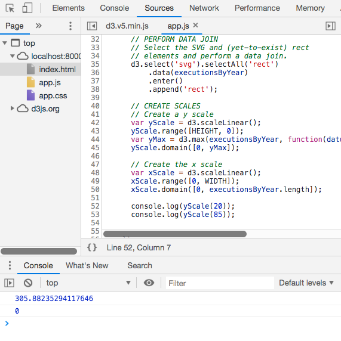


[SVG coordinate system]: https://developer.mozilla.org/en-US/docs/Web/SVG/Tutorial/Positions

### Render the bars

With our scale functions in place, we're ready to set the attributes on our columns and render them visually in the browser. Add the below code to `app.js` after the set-up code for the X and Y scales.

```
// SET VISUAL ATTRIBUTES
// Select rectangles and set the attributes.
// We use the scale functions to dynamically set attributes for x, y and height
d3.selectAll('rect')
  	.attr('height', function(datum, index){ return HEIGHT - yScale(datum.value) })
  	.attr('width', WIDTH/executionsByYear.length)
  	.attr('x', function(datum, index){ return xScale(index) })
  	.attr('y', function(datum, index){ return yScale(datum.value) })
  	.attr('fill', '#3333FF');
```

If you reload the page, you should now a bar chart:

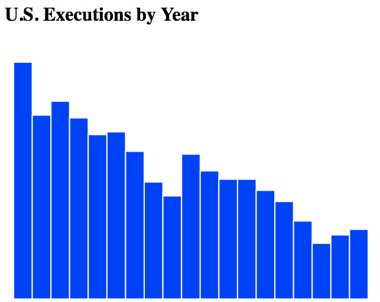

Some notes on the above:

* The `height` attribute subtracts the pixel value from `yScale` from the overall height. For small values, the height of the rectangle will be small. 
* The `y` coordinate sets the starting pixel coordinate for the bars. As discussed above, a lower data value (i.e. number of executions) will result in a higher pixel value. 

Again, try dropping some `console.log` statements into the code or setting debugger breakpoints in `app.js` to experiment.
Try disabling some of the attributes to see the effect.

For example, what happens if you remove the code that sets the `y` coordinate? Can you explain why?


### Add axes

Let's add some axis labels to our chart.

Years should appear under the bars, and the count of executions on the left axis. Add the below to `app.js` after the code that renders the rectangles of the bar.

```js
// CREATE AXES
var leftAxis = d3.axisLeft(yScale);
d3.select('svg')
  .append('g')
  .call(leftAxis);
	
// Create a scale band that maps years to horizontal positions
var yearScale = d3.scaleBand();
var yearDomain = executionsByYear.map(function(year){
  return year.key
});
yearScale.range([0, WIDTH]);
yearScale.domain(yearDomain);
	
// Create a bottom axis generator that uses the yearScale
var bottomAxis = d3.axisBottom(yearScale);
d3.select('svg')
.append('g')
.attr('transform', 'translate(0,'+HEIGHT+')') //move it to the bottom of the svg
.call(bottomAxis); // create a bottom axis within that <g>
```

Some notes on the above:

* We use the [SVG group]() element (`g`) to contain the axes.
* `yearDomain` generates an array of years for the bottom axis
* the `transform` attribute is used to move the x axis to the bottom of the chart.

[SVG group]:https://developer.mozilla.org/en-US/docs/Web/SVG/Element/g

You should now see labels and ticks added to the axes:

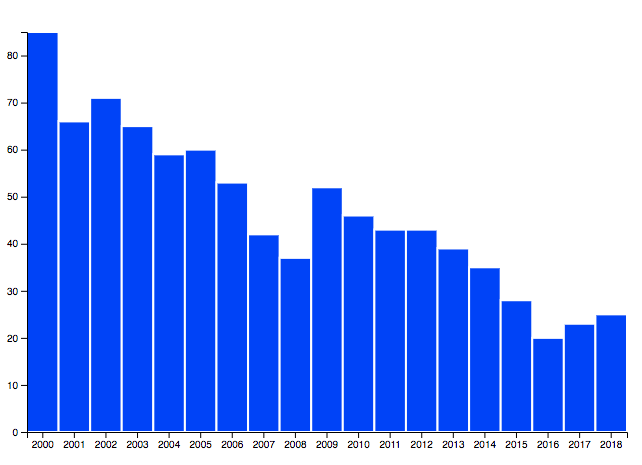

And again, try using log statements and the debugger to experiment with the code to ensure you understand the role of each bit of code.

For example, what happens if you remove the `transform` attribute on the bottom axis?

#### Style the axes

So we have our axes, but let's clean things up a little by removing the tick marks and axis lines.

Since we're dealing with SVG elements, you can use both D3 *and* CSS to control the appearance of the chart.

> Check out the [d3-axis docs](https://github.com/d3/d3-axis) and the [Axis Styling][] code example for useful techniques, in particular how to remove the ".domain" line on an axis to clean up styling

[Axis Styling]: https://bl.ocks.org/mbostock/3371592

First, let's remove the tick marks by adding the below to `app.css`:

```css
.tick line {
  display: none;
}
```

If you reload the browser, the tick marks should be gone. But the "domain" lines that include the first and last tick marks remain. Let's get rid of those lines entirely. We'll borrow a trick from the [Axis Styling][] example code to remove the lines, which have a class attribute of `.domain`. 

Add the following line in `app.js` after `call(bottomAxis);`:

```js
d3.selectAll(".domain").remove();
```

Reload the browser to view the newly styled axes:

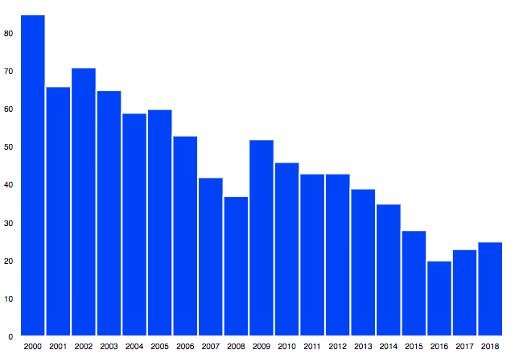

## Add Interactivity

The final step involves adding a dynamic tooltip when a user hovers over one of the columns. The code below is adapted from Mike Bostock's [Simple d3.js tooltips][] example, but the ideas can be extended for other types of interactivity.

[Simple d3.js tooltips]: http://bl.ocks.org/d3noob/a22c42db65eb00d4e369

To add interactive elements, we need to tap into user interactions with the page. This is traditionally done by attaching [event handlers][] to page elements. 

[event handlers]: https://developer.mozilla.org/en-US/docs/Web/Events

In our case, we want to trigger a tooltip that shows the number of executions when a user hovers on a column. And of course, we need to remove the tooltip when the user stops hovering. 

We'll use D3 to attach functions that handle these events to all columns, along with some CSS to style the tooltip.

Start by adding the below to `app.css`:

```css
div.tooltip {
  position: absolute;
  text-align: center;
  width: 65px;
  height: 28px;
  padding: 2px;
  font: 12px sans-serif;
  background: lightsteelblue;
  border: 0px;
  border-radius: 8px;
  pointer-events: none;
}
```

Next, we'll create the tooltip HTML in D3 and add event handler functions to the columns. These handler function will be responsible for hiding and showing the tooltips based on mouse interactions.

Add the below code to `app.js` after the code that removed the axis domain elements:

```js
// Define the div for the tooltip
// (div is initially hidden through opacity setting)
var div = d3.select("body").append("div")
    .attr("class", "tooltip")
    .style("opacity", 0);

// Define the mouse event handlers
function mouseover(d) {
  div.transition()
      .duration(200)
      .style("opacity", .9);
  div.html(d.value + "</br>executions")
      .style("left", (d3.event.pageX) + "px")
      .style("top", (d3.event.pageY - 28) + "px");
}

function mouseout(d) {
  div.transition()
     .duration(500)
     .style("opacity", 0);
}

// Add mouse event handlers
d3.selectAll('rect')
  .on("mouseover", mouseover)
  .on("mouseout", mouseout);
```

A few notes on the above:

* We created a "hidden" div for our tooltip
* We created handlers for mouse events and used [D3 transition](https://github.com/d3/d3-transition) to smooth the appearance and disappearance of the tooltip. Otherwise the tooltip would abruptly appear and vanish.
* We used [`.on`](https://github.com/d3/d3-selection#selection_on) to attach the event handlers to all rectangles.

If you reload the page and hover on a bar, you should see the tooltip:

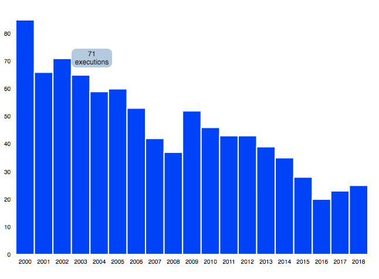

## What's next?

The strategies covered here can be adapted to provide more interactive features. For example, the chart could be updated to display demographic breakdowns for a given year when a user clicks on a bar.

At a high-level, the coding strategy would involve:

* Updating the data preparation code to include nested data for demographics by age, gender and race.
* Adding "click" handlers to create and remove a page element displaying demographic info for a year. This could be a combination of text and more visuals.
* Adding CSS, as needed, to style the page element for demographic info.

It would also be useful to add narrative to the page detailing the total number of executions across all years along with top-line summary statistics. We can use D3 to [summarize][] and [group][] data to dynamically generate these figures and produce templated text that stays in sync with the source data.


[Data Viz with D3 Cookbook]: https://searchworks.stanford.edu/view/13214391]


